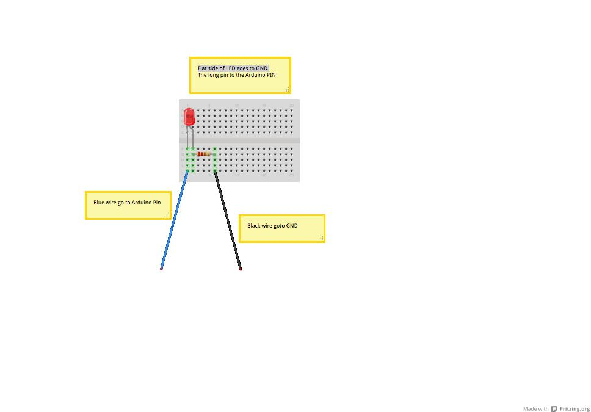
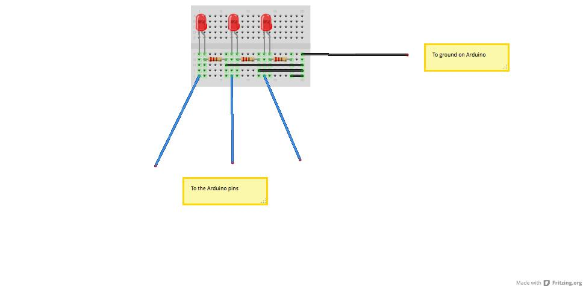

## Setup

Prerequisite:

* NodeJS
* npm
* git
* Arduino
* Breadboard
* LED & resisters

## Intro

Let's get an LED to blink.



## Try more than One



## Now let's control LED's from a web page

git clone https://github.com/avermeulen/express-seed the-light

```
cd the-light
npm install
nodemon index.js
```

## Let's talk to the lights

Let's control the lights by saying:
* `switch on`
* `switch off`
* `blink blink`
